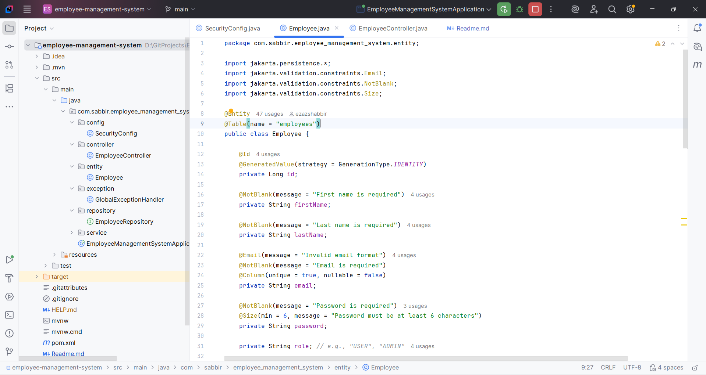
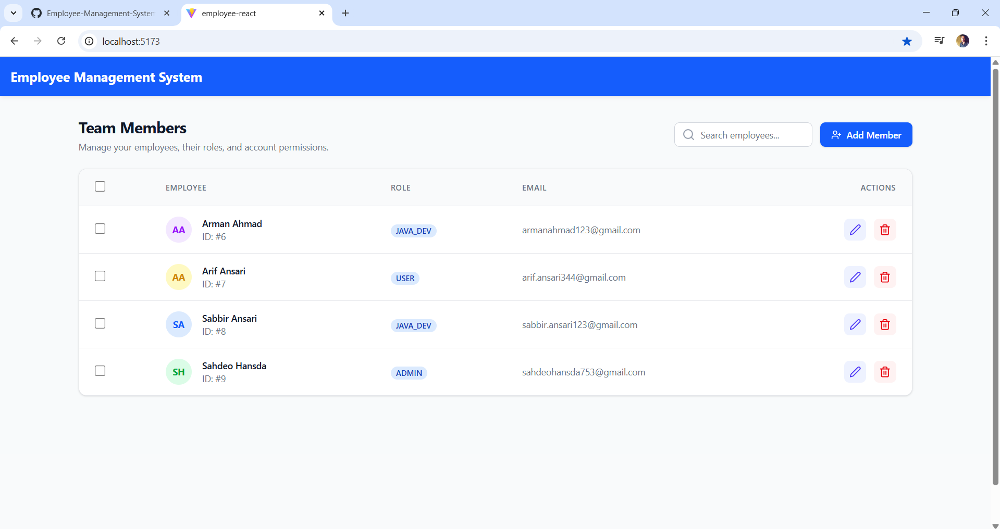
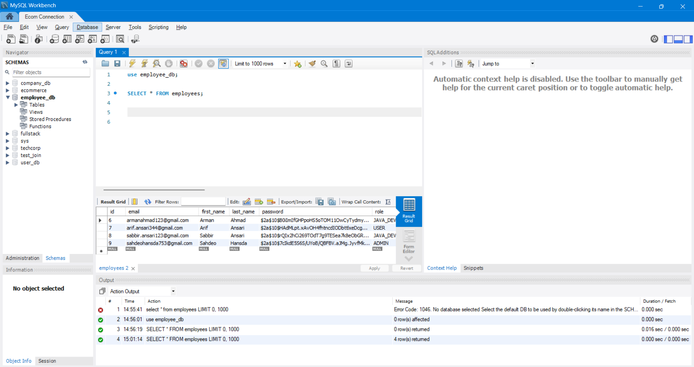
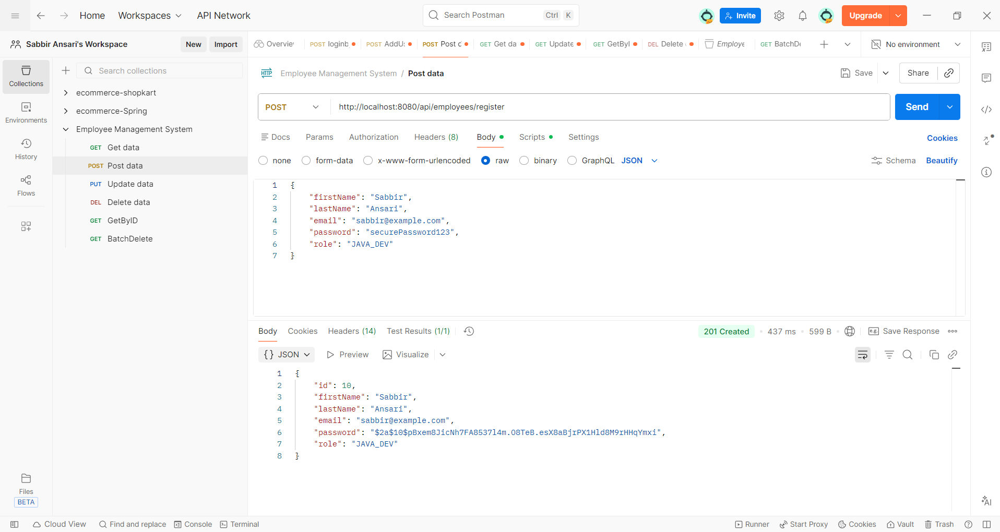

# Employee-Management-System-CRUD









## 📌 Project Overview

This is a **full-stack Employee Management System** that implements **CRUD operations (Create, Read, Update, Delete)** using a real backend, frontend, and database.

This project is built for **practical understanding**, not just theory — focusing on how **Spring Boot APIs**, **React frontend**, and **MySQL database** interact in a real-world setup.

---

## 🛠 Tech Stack

### Backend
- **Spring Boot** – REST API development
- **IntelliJ IDEA** – Backend IDE
- **Spring Data JPA & Hibernate** – ORM
- **MySQL** – Relational database

### API Testing
- **Postman** – Testing REST endpoints (GET, POST, PUT, DELETE)

### Database
- **MySQL Workbench** – Database design and SQL queries

### Frontend
- **React.js** – Frontend UI
- **VS Code** – Frontend IDE
- **Axios / Fetch API** – Backend communication

---

## ✨ Features

- Create new employees
- View all employees
- Get employee details by ID
- Update employee information
- Delete employee records
- RESTful API design
- Layered architecture (Controller, Service, Repository)

---

## 📂 Backend Project Structure

```

src/main/java
└── com.example.employeemanagement
├── controller
├── service
├── repository
├── model
└── EmployeeManagementApplication.java


---

## 🔗 REST API Endpoints

| Method | Endpoint              | Description              |
|------|----------------------|--------------------------|
| GET  | `/api/employees`      | Fetch all employees      |
| GET  | `/api/employees/{id}` | Fetch employee by ID     |
| POST | `/api/employees`      | Create new employee      |
| PUT  | `/api/employees/{id}` | Update employee details  |
| DELETE | `/api/employees/{id}` | Delete employee         |

---

## 🧪 API Testing

All endpoints are tested using **Postman** to verify:
- Correct request and response flow
- Proper HTTP status codes
- JSON payload validation

---

## 🗄 Database Design

- Database created and managed using **MySQL Workbench**
- `employee` table includes:
  - `id`
  - `name`
  - `email`
  - `department`
  - `salary`

---

## 🎯 Learning Outcome

This project provides hands-on experience with:
- Building REST APIs using **Spring Boot**
- Connecting **React frontend** with backend APIs
- Working with a real **MySQL database**
- Understanding real development tools and workflow

This is **far more valuable than tutorial-only projects**.
If you can explain this project confidently, it **actually counts**.

---

## 🚀 How to Run the Project

### Backend
1. Open the backend project in **IntelliJ IDEA**
2. Configure database credentials in `application.properties`
3. Run `EmployeeManagementApplication`

### Frontend
1. Open the React project in **VS Code**
2. Run:
```bash
npm install
npm start
````

---


### Logical next upgrades:

* Pagination & sorting
* Input validation
* JWT-based authentication
* Role-based access control

